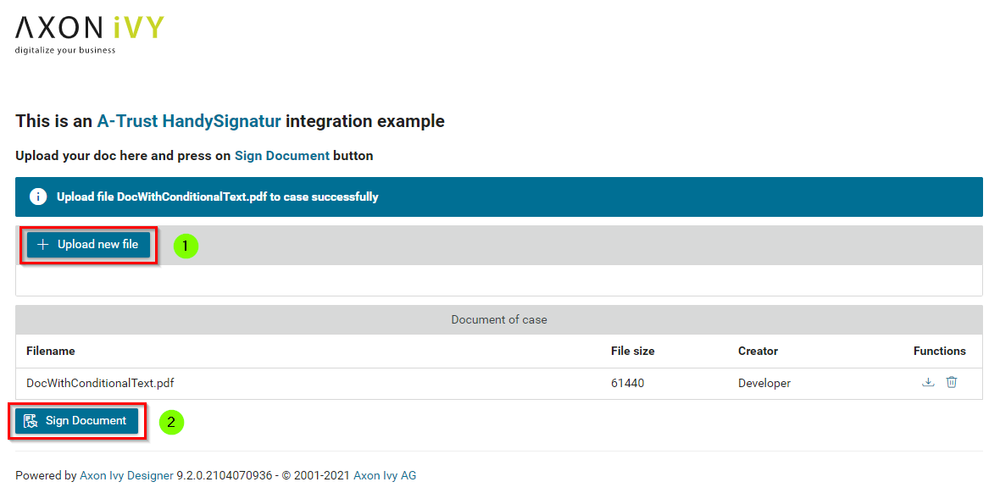
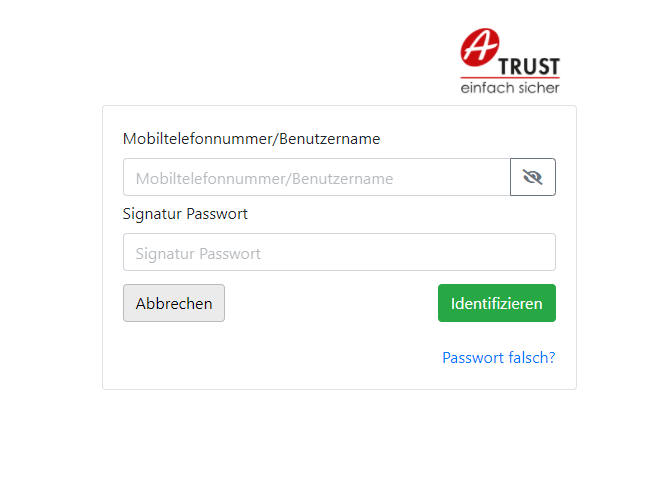
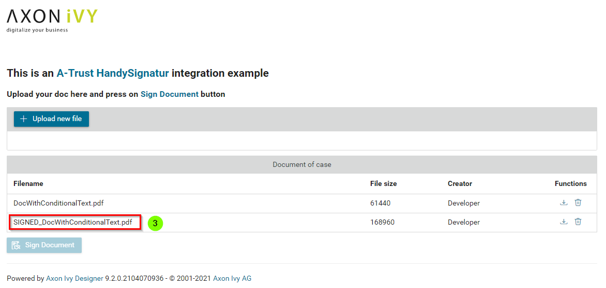
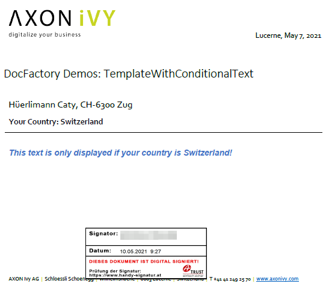
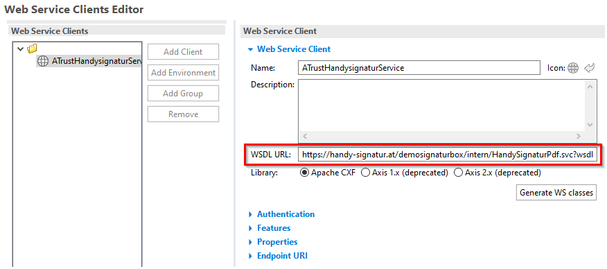
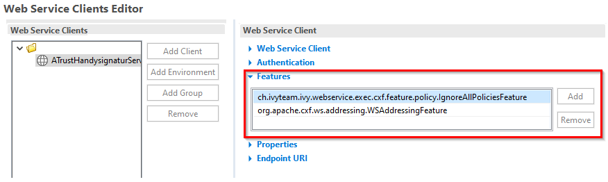
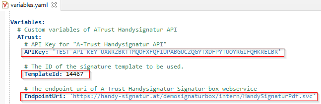
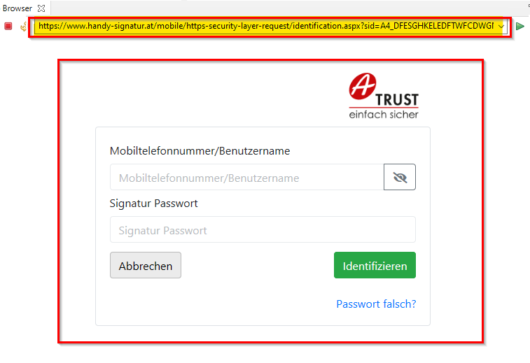
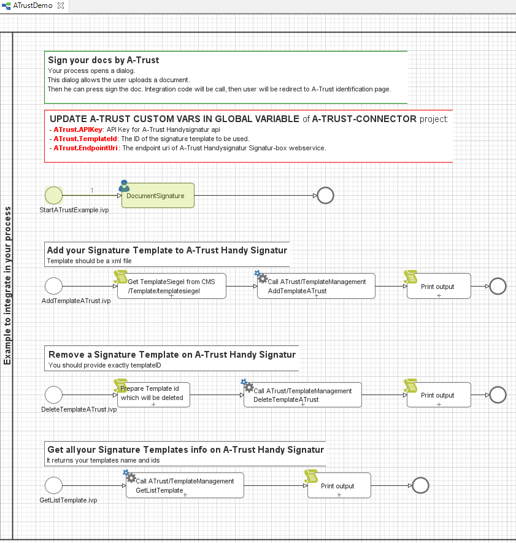

**Axon Ivy’s [A-Trust](https://www.a-trust.at)** connector helps you to accelerate process automation initiatives by integrating **A-Trust** into your process application within no time. **A-Trust** with the mobile phone signature, you can clearly authenticate yourself on the Internet. It is your personal signature on the net, which is equivalent to the handwritten signature by law. This connector:

*	Is based on SOAP web service technologies.
*	Provides access to the core features of A-Trust to virtually sign all kinds of documents.
*	Supports you with an easy-to-copy demo implementation to reduce your integration effort.
*	Enables low code citizen developers to enhance existing business processes with mobile phone signature features.

## Demo

1. Upload a **pdf** document.

   

2. Click on **Sign Document** and signers will be forwarded to the **Handy-Signatur** identification page.

   

3. After signed, a new document will be added to your case with the prefix ***SIGNED_***

   

4. You can download and open **Adobe PDF** to see your signature at bottom of doc.

   

## Setup

Before any signing interactions between the **Axon Ivy Engine** and the **A-Trust Handy Signatur** services can be run, they have to be introduced to each other. This can be done as follows:

1. Register an A-Trust Handy-Signatur account: https://www.a-trust.at/en/handy-signatur/handy-signatur-activation/

2. Create an A-Trust Signatur-Box and get a new open API key: https://www.a-trust.at/en/handy-signatur/signaturbox/

3. Open the `Definitions/Web Service Clients` Editor in your Designer and select `ATrustHandysignaturService` client.

4. Edit the web service `WSDL URL` to your ***Signatur-box*** endpoint:

   

5. Scroll to **Features** add `IgnoreAllPoliciesFeature` and `WSAddressingFeature`

   

6. Click on the `Generate WS classes` button, then save and close `Web Service Clients`. Make sure your endpoint URL is generated correctly.

7. Open the `Configuration/variables.yaml` in your Designer and edit `APIKey`, `ATrustTemplateId`

   

8. Save the changed settings.

9. Start `ATrustIntegration/DemoStart/StartATrustExample.ivp` of the `atrust-connector-demo` project to test your setup.

      Your setup was correct if you are being forwarded to the ***[A-Trust identification](https://www.handy-signatur.at/mobile/https-security-layer-request/identification.aspx)*** page.

      

### Notes:

The DemoStart process contains a final service part, where we prepared a signature template on the A-Trust server.

   

* You need to upload a signature template and update `ATrustTemplateId` value in the `Configuration/variables.yaml`.
* An example SignatureTemplate in CMS: `cms/Templates/tempsiegel1`.
* Upload template process available in `DemoStart.mod` process of `atrust-connector-demo` project. A-trust returns `templateID` and sets it in project Variables!
* **Handy Signatur** is probably only possible for **AUSTRIANS**.
* Check the latest API description on the **[A-Trust](https://www.a-trust.at)** webpage.
