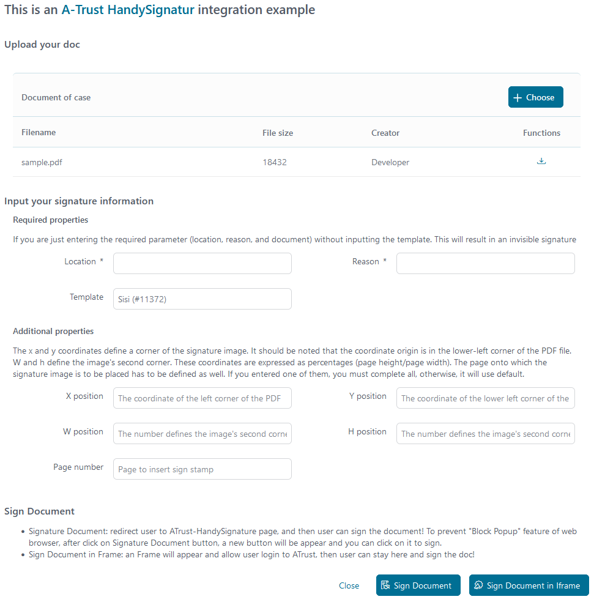
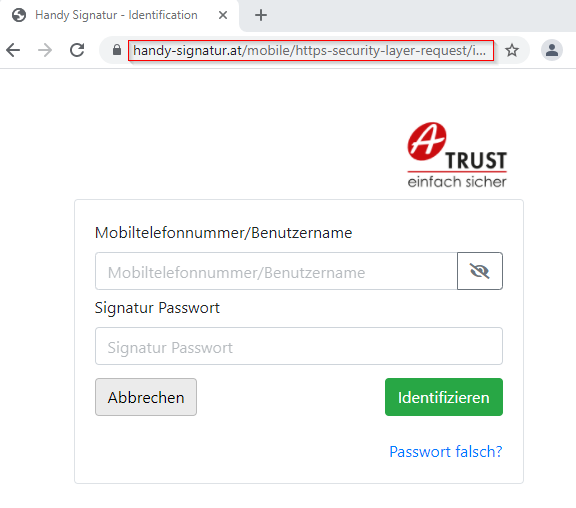
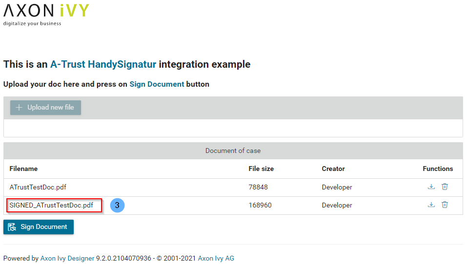
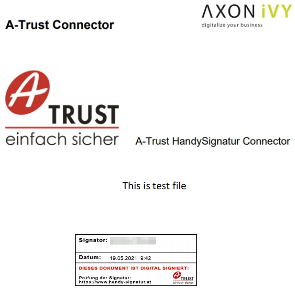
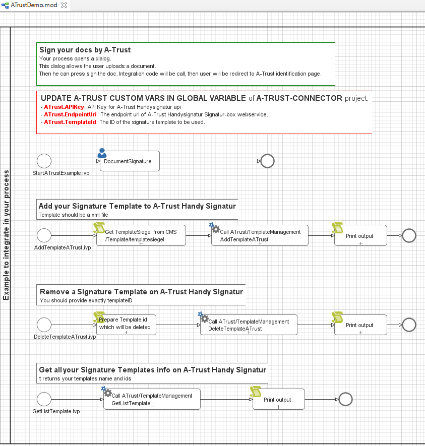

Axon Ivy’s [A-Trust](https://www.a-trust.at) connector helps you to accelerate process automation initiatives by integrating **A-Trust HandySignatur** into your process application within no time. **A-Trust** with the mobile phone signature, you can clearly authenticate yourself on the Internet. It is your personal signature on the net, which is equivalent to the handwritten signature by law. This connector:

*	Is based on **SOAP** web service technologies.
*	Provides access to the core features of **A-Trust** to virtually sign PDFs.
*	Supports you with an easy-to-copy demo implementation to reduce your integration effort.
*	Enables low code citizen developers to enhance existing business processes with mobile phone signature features.
*	This is only working in Austria.


## Demo

1. Upload a **PDF** document.

   

2. Click on **Sign Document** and signers will be forwarded to the **HandySignatur** identification page.

   - Log in with your mobile phone signature certificate.

   
   
   - Check notification on your phone, and follow up the **A-Trust** guide to add your signature to doc.

3. After signed, a new document will be added to your case with the prefix ***SIGNED_***

   

4. You can download and open **Adobe PDF** to see your signature at bottom of doc.

   

The **ATrustDemo** process contains a final service part, where we prepared a signature template on the **A-Trust** server.

   

* You need to upload a **SignatureTemplate** to the **[A-Trust](https://www.a-trust.at)** service. Uses `AddTemplateATrust` start in the `ATrustDemo` process of `a-trust-connector-demo` project.

   When uploading successfully, **A-Trust** returns `templateID` and sets it in project Variables - `TemplateId` value in the `Configuration/variables.yaml`.

* An example **SignatureTemplate** in CMS: `cms/Templates/tempsiegel1`.


## Setup

Before any signing interactions between the **Axon Ivy Engine** and the **A-Trust HandySignatur** services can be run, they have to be introduced to each other. This can be done as follows:

1. Register an **A-Trust HandySignatur** account: https://www.a-trust.at/en/handy-signatur/handy-signatur-activation/

2. Create an **A-Trust Signatur-Box** **[here](https://www.a-trust.at/en/handy-signatur/signaturbox)** and then get a new `API key` with the `Endpoint URI` web service.

3. Open the `Configuration/variables.yaml` in your Designer and paste the below code with your `APIKey`, `TemplateId`, `EndpointUri`

   ```
   Variables:
     # Custom variables of ATrust Handysignatur API
     ATrust:
       # API Key for "A-Trust Handysignatur API"
       APIKey: 'your API Key'

       # The endpoint uri of A-Trust Handysignatur Signatur-box webservice
       EndpointUri: 'your Endpoint URI'

       # The ID of the signature template to be used.
       TemplateId: # your TemplateId with number format, e.g: 1

   ```

4. Save the changed settings.


### Prerequisites:

* Working **A-TRUST** `API Key` (set in the global variable) - Needed to call **SOAP** services.
* You will also get the correct `ENDPOINT URL` from **A-TRUST** when checking their website!
* You need to upload a **SignatureTemplate** to the **[A-Trust](https://www.a-trust.at)** service before calling **ATrust/StartSignature**.
* **HandySignatur** is only available for people with an Austrian mobile phone number as well as an address in Austria.
* Check the latest API description on the **[A-Trust](https://www.a-trust.at)** webpage.
