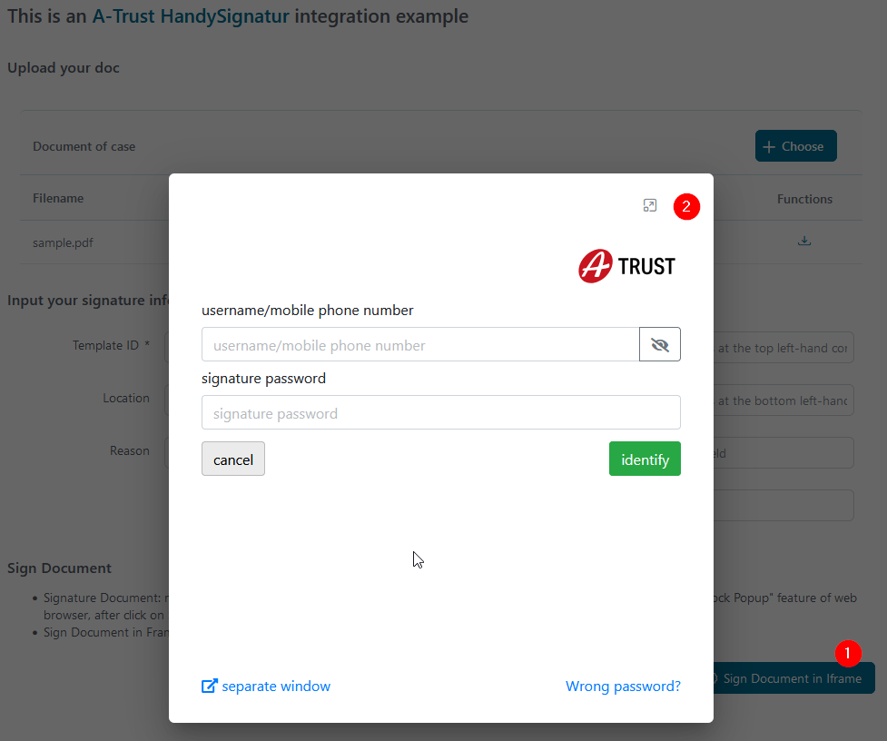

Axon Ivy's [A-Trust](https://www.a-trust.at) connector helps you to accelerate process automation initiatives by integrating **A-Trust HandySignatur** into your process application within no time. **A-Trust** with the mobile phone signature, you can clearly authenticate yourself on the Internet. It is your personal signature on the net, which is equivalent to the handwritten signature by law. This connector:

*	Is based on **REST API** technologies.
*	Provides access to the core features of **A-Trust** to virtually sign PDFs.
*	Supports you with an easy-to-copy demo implementation to reduce your integration effort.
*	Enables low code citizen developers to enhance existing business processes with mobile phone signature features.

To use A-Trust, you need an account that you create at https://www.a-trust.at/de/produkte/qualifizierte_signaturservices/xidentity/.


## Demo

1. Start the **A-Trust HandySignatur Example** process.
2. Prepare data for signing
    * Upload a **PDF** document.
    * Select your signature template.
    * Enter location, reason, and sign stamp coordinates x, y, and w if you would like to beautify it.
 
    

2. Start signing document

   There are have 2 options:
   
   1.  Signature Document: redirect user to ATrust-HandySignature page, and then user can sign the    document! To prevent "Block Popup" feature of web browser, after click on Signature Document button, a new button will be appear and you can click on it to sign.
   2.  Sign Document in Frame: an Frame will appear and allow user login to ATrust, then user can stay here and sign the doc!

   Let's try with IFrame option, click on **Sign Document in Frame** and a popup will appear and let user login to **ATrust HandySignature** page

    - Log in with your mobile phone signature certificate.
      
   
   - Check notification on your phone, and follow up the **A-Trust** guide to add your signature to doc.

3. After signed, a new document will be added to your case with the prefix ***SIGNED_***

   

4. You can download and open **Adobe PDF** to see your signature at bottom of doc.

   

The **ATrustDemo** process contains a final service part, where we prepared a signature template on the **A-Trust** server.

   

* You need to upload a **SignatureTemplate** to the **[A-Trust](https://www.a-trust.at)** service. Uses `AddTemplateATrust` start in the `ATrustDemo` process of `a-trust-connector-demo` project.

   When uploading successfully, **A-Trust** returns `templateID` and sets it in project Variables - `TemplateId` value in the `Configuration/variables.yaml`.

* An example **SignatureTemplate** in CMS: `cms/Templates/tempsiegel1`.


## Setup

Before any signing interactions between the **Axon Ivy Engine** and the **A-Trust HandySignatur** services can be run, they have to be introduced to each other. This can be done as follows:

1. Register an **A-Trust HandySignatur** account: https://www.a-trust.at/en/handy-signatur/handy-signatur-activation/

2. Create an **A-Trust Signatur-Box** **[here](https://www.a-trust.at/en/handy-signatur/signaturbox)** and then get a new `API key` with the `ServerUrl` and `SignBox`.

3. Open the `Configuration/variables.yaml` in your Designer and paste the below code with your `APIKey`, `TemplateId`, `ServerUrl` and `SignBox`

   ```
   Variables:
      ATrust:
        # API Key for "A-Trust Handysignature API"
        APIKey: ''
    
        # The Server URL under which the SigBox Server is reachable
        ServerUrl: ''
        
        # The SignBox belong to your ATrust server
        SignBox: ''
    
        # The default signature template ID to be used
        TemplateId: 0
    
        # To config the Handy-Signature view in iframe. The Details can be found on the A-Trust Website https://labs.a-trust.at/developer/Handy-Signatur.aspx.
        HandySignaturParameter:
          # For setting width of frame.
          Width: 350
          # For setting height of frame.
          Height: 350
          # For setting background color of frame.
          BackgroundColor: 0
          # For setting phone number of frame.
          PhoneNumber: 0
   ```

4. Save the changed settings.


### Prerequisites:

* Working **A-TRUST** `API Key` (set in the variable) - Needed to call **REST API** services.
* You will also get the correct `ServerUrl` and `SignBox` from **A-TRUST** when checking their website!
* You need to upload a **SignatureTemplate** to the **[A-Trust](https://www.a-trust.at)** service before calling **ATrust/StartSignature**.
* Check the latest API description on the **[A-Trust](https://www.a-trust.at)** web page.

### Built-in Component for IFrame Signing

The A-Trust connector provides a pre-built JSF component (`ATrustSignInFrame`) that enables seamless integration of A-Trust HandySignatur functionality directly within your Axon Ivy application using an embedded iframe. This component eliminates the need for popup windows and provides a more integrated user experience.

#### Component Overview

The `ATrustSignInFrame` component encapsulates the complete signing workflow within your application's UI, handling the authentication process, document signing, and result processing automatically.

#### Integration Steps

1. **Add the Component to Your JSF Page**

   Include the component in your XHTML file using the following syntax:

   ```xhtml
   <ic:com.axonivy.connector.atrust.ATrustSignInFrame
      signatureJob="#{data.signatureJob}"
      addDocToCase="true"
      disableSignButton="#{data.disableSignButton}"
      signDialogHeader="Document Signing"
      signButtonIcon="si si-pen-2"
      signButtonLabel="Sign Document"
      signButtonStyleClass="btn btn-primary"
      onSignatureFinishedListener="#{logic.onSignFinished()}"
      componentToUpdate="form" />
   ```

#### Component Attributes

| Attribute | Type | Required | Description |
|-----------|------|----------|-------------|
| `signatureJob` | `SignatureJob` | Yes | The signature job object containing document and signing parameters |
| `addDocToCase` | `Boolean` | No | When `true`, automatically adds the signed document to the current case (default: `false`) |
| `disableSignButton` | `Boolean` | No | Controls the enabled state of the sign button (default: `false`) |
| `signDialogHeader` | `String` | No | Custom header text for the signing dialog |
| `signButtonIcon` | `String` | No | CSS class for the button icon (supports [Streamline Icons](https://streamlineicons.com/)) |
| `signButtonLabel` | `String` | No | Text label for the sign button (default: "Sign") |
| `signButtonStyleClass` | `String` | No | Additional CSS classes for button styling |
| `onSignatureFinishedListener` | `MethodExpression` | No | Callback method executed after successful signing |
| `componentToUpdate` | `String` | No | ID of the component to update after signing completion |
