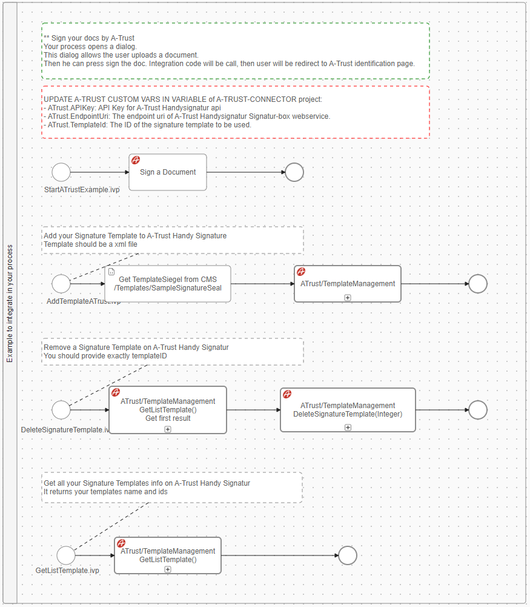

Der [A-Trust](https://www.a-trust.at) Konnektor von Axon Ivy hilft Ihnen dabei,
Initiativen zur Prozessautomatisierung zu beschleunigen, indem er **A-Trust
HandySignatur** innerhalb kürzester Zeit in Ihre Prozessanwendung integriert.
**A-Trust** Mit der HandySignatur können Sie sich im Internet eindeutig
authentifizieren. Es handelt sich dabei um Ihre persönliche Signatur im Netz,
die rechtlich einer handschriftlichen Unterschrift gleichkommt. Dieser
Konnektor:

*   Basiert auf den Technologien „ **” und „REST API** ”.
*   Bietet Zugriff auf die Kernfunktionen von **A-Trust** zum virtuellen
    Signieren von PDF-Dateien.
*   Unterstützt Sie mit einer einfach zu kopierenden Demo-Implementierung, um
    Ihren Integrationsaufwand zu reduzieren.
*   Ermöglicht Low-Code-Citizen-Developern, bestehende Geschäftsprozesse mit
    Funktionen für die Unterschrift per Mobiltelefon zu verbessern.

Um A-Trust nutzen zu können, benötigen Sie ein Konto, das Sie unter
https://www.a-trust.at/de/produkte/qualifizierte_signaturservices/xidentity/
erstellen können.


## Demo

1. Starten Sie den Prozess „ **A-Trust HandySignatur Beispiel** ”.
2. Daten für die Signatur vorbereiten
    * Hochladen Sie ein PDF-Dokument mit dem Namen „ **” (** ) hoch.
    * Wählen Sie Ihre Signaturvorlage aus.
    * Geben Sie den Standort, den Grund und die Koordinaten x, y und w des
      Stempels ein, wenn Sie ihn verschönern möchten.

   

2. Beginnen Sie mit der Unterzeichnung des Dokuments.

   Es gibt zwei Möglichkeiten:

   1.  Signaturdokument: Leiten Sie den Benutzer zur ATrust-HandySignature-Seite
       weiter, wo er das Dokument unterschreiben kann! Um die Funktion „Popups
       blockieren” des Webbrowsers zu umgehen, erscheint nach dem Klicken auf
       die Schaltfläche „Signaturdokument” eine neue Schaltfläche, auf die Sie
       klicken können, um zu unterschreiben.
   2.  Dokument im Rahmen signieren: Es erscheint ein Rahmen, in dem sich der
       Benutzer bei ATrust anmelden kann. Anschließend kann der Benutzer hier
       bleiben und das Dokument signieren!

   Probieren wir es mit der IFrame-Option. Klicken Sie auf „ **-Signaturdokument
   im Frame** ”. Es erscheint ein Popup-Fenster, in dem sich der Benutzer bei
   **ATrust HandySignature** anmelden kann.

    - Melden Sie sich mit Ihrem mobilen Signaturzertifikat an.
      

   - Überprüfen Sie die Benachrichtigung auf Ihrem Telefon und folgen Sie der
     Anleitung „ **“ (A-Trust** ) von A-Trust, um Ihre Unterschrift zur
     Dokumentation hinzuzufügen.

3. Nach der Unterzeichnung wird Ihrem Fall ein neues Dokument mit dem Präfix „
   ***SIGNED_*” hinzugefügt.**

   

4. Sie können **herunterladen und mit Adobe PDF** öffnen, um Ihre Signatur am
   Ende des Dokuments zu sehen.

   

Der Prozess „ **ATrustDemo** ” enthält einen abschließenden Service-Teil, in dem
wir eine Signaturvorlage auf dem Server „ **A-Trust** ” vorbereitet haben.



* Sie müssen eine **SignatureTemplate** auf den
  **[A-Trust](https://www.a-trust.at)** Dienst hochladen. Verwenden Sie
  `AddTemplateATrust` starten Sie den `ATrustDemo` Prozess von
  `a-trust-connector-demo` Projekt.

  `Nach erfolgreichem Hochladen gibt **A-Trust** die Vorlage-ID
  `templateID` zurück und legt sie in den Projektvariablen fest – `TemplateId`
  Wert in der Konfiguration/variables.yaml`.

* Ein Beispiel **SignatureTemplate** im CMS: `cms/Templates/tempsiegel1`.

## Setup

Bevor Signaturvorgänge zwischen den Diensten **Axon Ivy Engine** und **A-Trust
HandySignatur** durchgeführt werden können, müssen diese einander vorgestellt
werden. Dies kann wie folgt erfolgen:

1. ** Registrieren Sie sich für eine A-Trust HandySignatur **- :
   https://www.a-trust.at/en/handy-signatur/handy-signatur-activation/

2. Erstellen Sie eine **A-Trust Signatur-Box**
   **[hier](https://www.a-trust.at/en/handy-signatur/signaturbox)** und erhalten
   Sie dann einen neuen `API-Schlüssel` mit dem `ServerUrl` und `SignBox`.

3. Öffnen Sie die Datei „ `Configuration/variables.yaml”` in Ihrem Designer und
   fügen Sie den folgenden Code mit Ihrem APIKey `,`, `TemplateId`, `ServerUrl`
   und `SignBox ein.`

   ```
   Variables:
      ATrust:
        # API Key for "A-Trust Handysignature API"
        APIKey: ''

        # The Server URL under which the SigBox Server is reachable
        ServerUrl: ''

        # The SignBox belong to your ATrust server
        SignBox: ''

        # The default signature template ID to be used
        TemplateId: 0

        # To config the Handy-Signature view in iframe. The Details can be found on the A-Trust Website https://labs.a-trust.at/developer/Handy-Signatur.aspx.
        HandySignaturParameter:
          # For setting width of frame.
          Width: 350
          # For setting height of frame.
          Height: 350
          # For setting background color of frame.
          BackgroundColor: 0
          # For setting phone number of frame.
          PhoneNumber: 0
   ```

4. Speichern Sie die geänderten Einstellungen.

### Voraussetzungen:

* Arbeits- **A-TRUST** `API-Schlüssel` (in der Variablen festgelegt) – Wird
  benötigt, um die REST-API** Dienste von **aufzurufen.
* Die korrekten Server-URLs `,` und `sowie die SignBox-URL` von **A-TRUST**
  finden Sie auf deren Website!
* Sie müssen eine **SignatureTemplate** auf den
  **[A-Trust](https://www.a-trust.at)** Dienst hochladen, bevor Sie
  **ATrust/StartSignature** aufrufen.
* Die aktuelle API-Beschreibung finden Sie auf der Webseite
  **[A-Trust](https://www.a-trust.at)**.

### Integrierte Komponente für IFrame-Signierung

Der A-Trust-Konnektor bietet eine vorgefertigte JSF-Komponente
(`ATrustSignInFrame`), die eine nahtlose Integration der
A-Trust-HandySignatur-Funktionalität direkt in Ihre Axon Ivy-Anwendung mithilfe
eines eingebetteten Iframes ermöglicht. Diese Komponente macht Popup-Fenster
überflüssig und sorgt für eine besser integrierte Benutzererfahrung.

#### Komponentenübersicht

Die Komponente „ `ATrustSignInFrame` ” kapselt den gesamten Signatur-Workflow in
der Benutzeroberfläche Ihrer Anwendung und übernimmt automatisch die
Authentifizierung, die Dokumentensignatur und die Ergebnisverarbeitung.

#### Integrationsschritte

1. **Fügen Sie die Komponente zu Ihrer JSF-Seite hinzu**

   Fügen Sie die Komponente mit der folgenden Syntax in Ihre XHTML-Datei ein:

   ```xhtml
   <ic:com.axonivy.connector.atrust.ATrustSignInFrame
      signatureJob="#{data.signatureJob}"
      addDocToCase="true"
      disableSignButton="#{data.disableSignButton}"
      signDialogHeader="Document Signing"
      signButtonIcon="si si-pen-2"
      signButtonLabel="Sign Document"
      signButtonStyleClass="btn btn-primary"
      onSignatureFinishedListener="#{logic.onSignFinished()}"
      componentToUpdate="form" />
   ```

#### Komponentenattribute

| Attribut                      | Typ                  | Erforderlich | Beschreibung                                                                                                                |
| ----------------------------- | -------------------- | ------------ | --------------------------------------------------------------------------------------------------------------------------- |
| `signatureJob`                | `SignatureJob`       | Ja           | Das Signatur-Job-Objekt enthält Dokument- und Signaturparameter.                                                            |
| `addDocToCase`                | `Boolesche Variable` | Nein         | Wenn „ `” wahr ist (`), wird das signierte Dokument automatisch zum aktuellen Fall hinzugefügt (Standard: „ `” falsch (`)). |
| `disableSignButton`           | `Boolesche Variable` | Nein         | Steuert den Aktivierungsstatus der Signatur-Schaltfläche (Standard: `false`)                                                |
| `signDialogHeader`            | `Zeichenfolge`       | Nein         | Benutzerdefinierter Kopfzeilentext für den Signaturdialog                                                                   |
| `signButtonIcon`              | `Zeichenfolge`       | Nein         | CSS-Klasse für das Schaltflächensymbol (unterstützt [Streamline Icons](https://streamlineicons.com/))                       |
| `signButtonLabel`             | `Zeichenfolge`       | Nein         | Textbezeichnung für die Schaltfläche „Signieren“ (Standard: „Signieren“)                                                    |
| `signButtonStyleClass`        | `Zeichenfolge`       | Nein         | Zusätzliche CSS-Klassen für die Gestaltung von Schaltflächen                                                                |
| `onSignatureFinishedListener` | `MethodExpression`   | Nein         | Callback-Methode, die nach erfolgreicher Signierung ausgeführt wird                                                         |
| `componentToUpdate`           | `Zeichenfolge`       | Nein         | ID der Komponente, die nach Abschluss der Signierung aktualisiert werden soll                                               |
