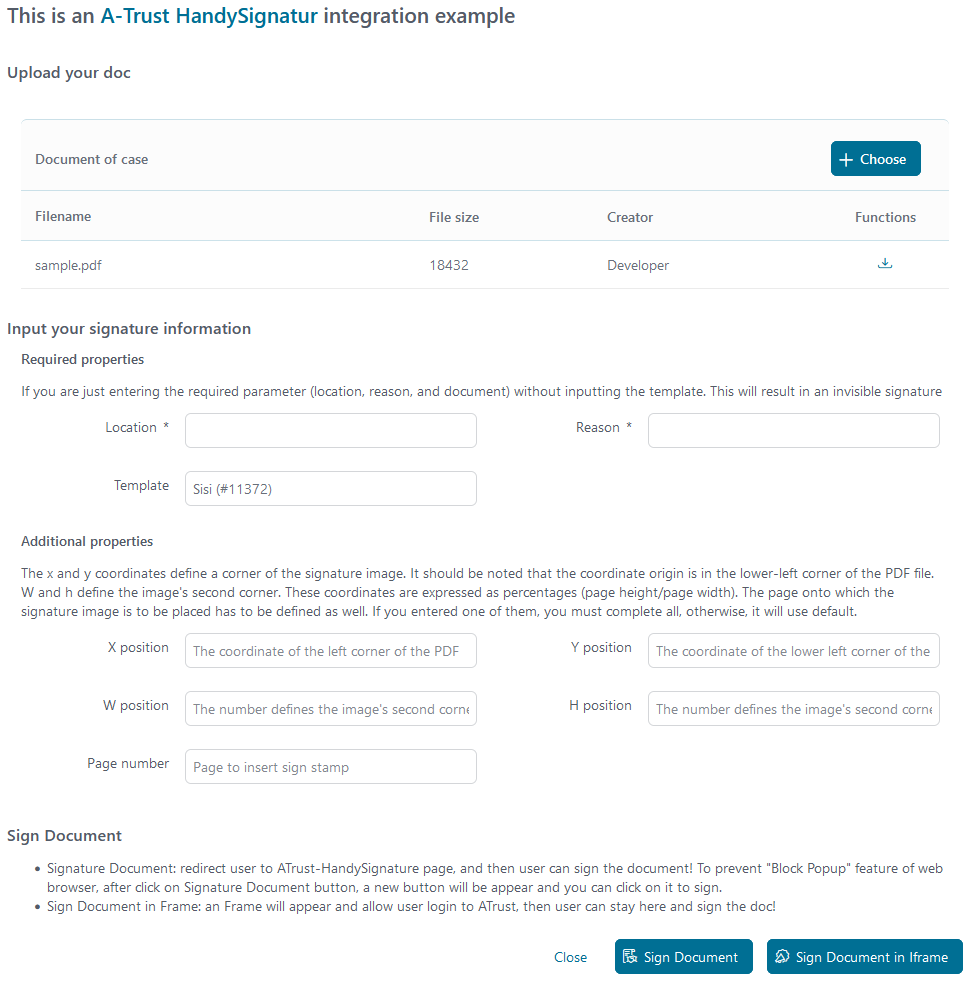
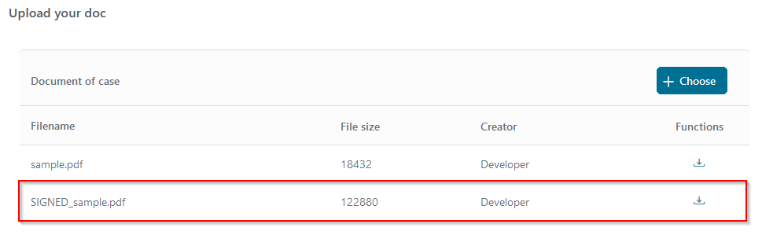

[A-Trust](https://www.a-trust.at) ist ein österreichisches Unternehmen, das elektronische Services, wie digitale Signaturen und Zertifikate, anbietet,
um eine sichere Online-Kommunikation zu gewährleisten. Die **Signaturbox** von A-Trust ist eine Lösung für digitale Signaturen, mit der 
Benutzer Dokumente sicher digital signieren können, um Authentizität (**Wer** signiert) und Integrität (**Was** wird signiert) zu gewährleisten.

- Basiert auf REST Web Service Technologien.
- Signiert PDFs.
- Unterstützt dich mit einer  Demo-Implementierung, um deinen Integrationsaufwand zu reduzieren.
- Ermöglicht es low code citizen developers bestehende Geschäftsprozesse mit Handy-Signaturfunktionen zu erweitern.

Für die Nutzung von A-Trust benötigst Du einen Account, den Dir https://www.a-trust.at/de/produkte/qualifizierte_signaturservices/xidentity/ erstellt.

## Demo

1. Upload a **PDF** document.

   

2. Click on **Sign Document** and signers will be forwarded to the **HandySignatur** identification page.

   - Log in with your mobile phone signature certificate.

   
   
   - Check notification on your phone, and follow up the **A-Trust** guide to add your signature to doc.

3. After signed, a new document will be added to your case with the prefix ***SIGNED_***

   

4. You can download and open **Adobe PDF** to see your signature at bottom of doc.

   

The **ATrustDemo** process contains a final service part, where we prepared a signature template on the **A-Trust** server.

   

* You need to upload a **SignatureTemplate** to the **[A-Trust](https://www.a-trust.at)** service. Uses `AddTemplateATrust` start in the `ATrustDemo` process of `a-trust-connector-demo` project.

   When uploading successfully, **A-Trust** returns `templateID` and sets it in project Variables - `TemplateId` value in the `Configuration/variables.yaml`.

* An example **SignatureTemplate** in CMS: `cms/Templates/tempsiegel1`.


## Setup

Before any signing interactions between the **Axon Ivy Engine** and the **A-Trust HandySignatur** services can be run, they have to be introduced to each other. This can be done as follows:

1. Register an **A-Trust HandySignatur** account: https://www.a-trust.at/en/handy-signatur/handy-signatur-activation/

2. Create an **A-Trust Signatur-Box** **[here](https://www.a-trust.at/en/handy-signatur/signaturbox)** and then get a new `API key` with the `Endpoint URI` web service.

3. Open the `Configuration/variables.yaml` in your Designer and paste the below code with your `APIKey`, `TemplateId`, `EndpointUri`

   ```
   Variables:
     # Custom variables of ATrust Handysignatur API
     ATrust:
       # API Key for "A-Trust Handysignatur API"
       APIKey: 'your API Key'

       # The endpoint uri of A-Trust Handysignatur Signatur-box webservice
       EndpointUri: 'your Endpoint URI'

       # The ID of the signature template to be used.
       TemplateId: # your TemplateId with number format, e.g: 1

   ```

4. Save the changed settings.


### Prerequisites:

* Working **A-TRUST** `API Key` (set in the global variable) - Needed to call **SOAP** services.
* You will also get the correct `ENDPOINT URL` from **A-TRUST** when checking their website!
* You need to upload a **SignatureTemplate** to the **[A-Trust](https://www.a-trust.at)** service before calling **ATrust/StartSignature**.
* **HandySignatur** is only available for people with an Austrian mobile phone number as well as an address in Austria.
* Check the latest API description on the **[A-Trust](https://www.a-trust.at)** webpage.
